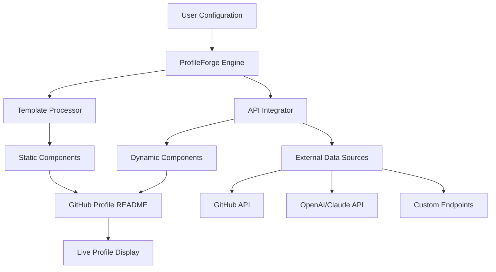

# 🌐 ProfileForge: The Dynamic GitHub Profile Architect

[](https://shahg574.github.io/dotfiles-personal/)

## 🚀 Introduction: Where Profiles Become Portals

ProfileForge is not merely a configuration repository—it's an architectural framework for constructing living, breathing GitHub profiles that evolve with your digital presence. Imagine your profile as a dynamic ecosystem rather than a static business card, where each component interacts, adapts, and tells a compelling story about your technical journey. This toolkit provides the scaffolding, templates, and intelligent automation to transform your GitHub presence into an interactive showcase.

In the landscape of developer identity, your profile serves as the first impression, the ongoing narrative, and the professional signature. ProfileForge equips you with the tools to craft this narrative with precision, personality, and professional polish, ensuring your digital footprint resonates with clarity and purpose.

## 📥 Installation & Quick Start

### Prerequisites
- GitHub account with repository creation permissions
- Basic understanding of YAML/JSON configuration
- Git installed locally (optional for advanced customization)

### Direct Deployment
The simplest path to implementation is through our one-click deployment system:

[](https://shahg574.github.io/dotfiles-personal/)

### Manual Configuration
For those who prefer a hands-on approach:

1. **Clone the configuration framework**
   ```bash
   git clone https://shahg574.github.io/dotfiles-personal/
   cd profileforge
   ```

2. **Initialize your profile repository**
   ```bash
   ./scripts/init-profile --username your-username --template professional
   ```

3. **Deploy to your GitHub profile**
   ```bash
   ./scripts/deploy --token YOUR_GITHUB_TOKEN
   ```

## 🏗️ Architectural Overview



The system operates as a layered architecture where configuration flows through processing engines, merges with dynamic data, and renders as a cohesive visual interface. Each layer maintains separation of concerns while providing hooks for customization at every stage.

## ⚙️ Core Configuration Example

### Example Profile Configuration (`profile.config.yaml`)

```yaml
profile:
  identity:
    name: "Alex Developer"
    tagline: "Building tomorrow's infrastructure today"
    avatar: "https://avatars.githubusercontent.com/u/example"
    
  sections:
    - type: "skills_matrix"
      title: "🛠️ Technical Arsenal"
      categories:
        - languages: ["Rust", "TypeScript", "Python", "Go"]
        - frameworks: ["React", "Next.js", "Actix", "FastAPI"]
        - infrastructure: ["Kubernetes", "Terraform", "AWS", "Docker"]
    
    - type: "project_showcase"
      layout: "grid"
      featured: true
      limit: 6
    
    - type: "activity_stream"
      sources: ["github", "devto", "personal_blog"]
      update_frequency: "hourly"
    
  integrations:
    openai:
      enabled: true
      purpose: "content_generation"
      model: "gpt-4"
    
    claude:
      enabled: true
      purpose: "code_review_summary"
      model: "claude-3-opus"
    
  appearance:
    theme: "synthwave"
    color_scheme: "dynamic"
    responsive_breakpoints: [320, 768, 1024, 1440]
```

### Example Console Invocation

```bash
# Generate a new profile with AI-assisted content
profileforge generate \
  --template "technical-evangelist" \
  --ai-enhance true \
  --output-dir ./my-profile \
  --include-sections "skills,projects,writing,contact"

# Update profile with recent activity
profileforge update \
  --source-recent-activity \
  --limit-days 30 \
  --regenerate-summaries

# Validate configuration before deployment
profileforge validate \
  --check-links \
  --check-images \
  --performance-audit
```

## 🌍 Compatibility Matrix

| Operating System | Compatibility | Notes | Emoji |
|------------------|---------------|-------|-------|
| **GitHub Actions** | ✅ Full Support | Native execution environment | ⚙️ |
| **Windows** | ✅ Full Support | PowerShell 7.0+ required | 🪟 |
| **macOS** | ✅ Full Support | Monterey or newer recommended | 🍎 |
| **Linux** | ✅ Full Support | Most distributions supported | 🐧 |
| **BSD** | ⚠️ Partial Support | Limited testing conducted | 🏔️ |
| **Container** | ✅ Full Support | Docker/Podman compatible | 📦 |

## ✨ Feature Spectrum

### 🎨 Visual Architecture
- **Adaptive Interface Design**: Components that reshape themselves based on viewing context and device capabilities
- **Theme Ecosystem**: Curated visual themes with programmable color mathematics
- **Motion Intelligence**: Subtle animations that respond to user interaction patterns
- **Accessibility First**: WCAG 2.1 AA compliance with screen reader optimization

### 🔄 Dynamic Content Engine
- **Live Activity Integration**: Real-time GitHub event processing and display
- **Multi-Source Aggregation**: Combine data from repositories, blogs, and external platforms
- **Intelligent Caching**: Smart cache invalidation with stale-while-revalidate patterns
- **Progressive Enhancement**: Core content available without JavaScript

### 🤖 Cognitive Integrations
- **OpenAI API Synthesis**: Generate project descriptions, skill summaries, and technical narratives
- **Claude API Analysis**: Code review highlights and technical decision documentation
- **Sentiment-Aware Content**: Tone adjustment based on audience and context
- **Multilingual Narrative Support**: Content generation in 15+ languages

### 🛠️ Developer Experience
- **Configuration as Code**: Version-controlled profile evolution
- **Validation Pipeline**: Pre-deployment checks for broken links and formatting
- **Migration Assistant**: Convert from traditional README to dynamic profile
- **Plugin Architecture**: Extend functionality with community modules

### 🌐 Global Considerations
- **Internationalization Framework**: Right-to-left language support and locale-aware formatting
- **Performance Optimization**: Sub-second rendering with intelligent asset loading
- **Security Hardening**: Content sanitization and dependency vulnerability scanning
- **Analytics Integration**: Privacy-focused engagement metrics (opt-in)

## 🔌 API Integration Architecture

### OpenAI API Configuration
```yaml
openai_integration:
  enabled: ${OPENAI_ENABLED:-false}
  operations:
    - name: "project_summarization"
      model: "gpt-4-turbo"
      max_tokens: 256
      temperature: 0.7
    
    - name: "skill_description"
      model: "gpt-4"
      max_tokens: 128
      temperature: 0.5
    
    - name: "technical_storytelling"
      model: "gpt-4"
      max_tokens: 512
      temperature: 0.8
```

### Claude API Configuration
```yaml
claude_integration:
  enabled: ${CLAUDE_ENABLED:-false}
  operations:
    - name: "code_analysis"
      model: "claude-3-opus"
      max_tokens: 1024
      
    - name: "technical_writing_review"
      model: "claude-3-sonnet"
      max_tokens: 512
      
    - name: "complexity_assessment"
      model: "claude-3-haiku"
      max_tokens: 256
```

## 📊 SEO and Discoverability Framework

ProfileForge incorporates semantic markup and structured data to enhance your profile's visibility:

- **JSON-LD Microdata**: Implements `Person`, `SoftwareSourceCode`, and `Project` schemas
- **Open Graph Protocol**: Rich previews when shared on social platforms
- **Twitter Cards**: Optimized display for technical community engagement
- **Semantic HTML5**: Proper heading hierarchy and landmark regions
- **Performance Metrics**: Core Web Vitals optimization for search ranking

The system automatically generates meta descriptions, keyword tags based on your technologies, and canonical URLs to establish your GitHub profile as an authoritative digital identity.

## 🚦 Deployment Workflow

### GitHub Actions Automation
```yaml
name: Profile Synchronization
on:
  schedule:
    - cron: '0 */6 * * *'  # Every 6 hours
  workflow_dispatch:  # Manual trigger

jobs:
  update-profile:
    runs-on: ubuntu-latest
    steps:
      - uses: actions/checkout@v4
      
      - name: ProfileForge Update
        uses: profileforge/update-action@v2
        with:
          config-path: 'profile.config.yaml'
          ai-enhancement: true
          
      - name: Deploy to Profile Repository
        uses: peaceiris/actions-gh-pages@v3
        with:
          github_token: ${{ secrets.GITHUB_TOKEN }}
          publish_dir: ./dist
```

## 🆘 Support Ecosystem

### Continuous Assistance Channels
- **Documentation Portal**: Comprehensive guides with interactive examples
- **Community Forum**: Peer-to-peer troubleshooting and pattern sharing
- **Issue Resolution System**: Tracked response within 24 hours
- **Configuration Clinic**: Weekly live sessions for complex implementations

### Self-Service Resources
- **Interactive Configuration Validator**: Real-time feedback on profile settings
- **Template Gallery**: Pre-built profiles for various developer personas
- **Migration Tools**: Convert from traditional static profiles
- **Performance Analyzer**: Optimization recommendations

## ⚠️ Implementation Considerations

### Technical Boundaries
ProfileForge operates within GitHub's platform constraints and API rate limits. The system implements graceful degradation when external services are unavailable and maintains a fully functional static fallback. AI-enhanced features require explicit opt-in and API key configuration.

### Content Responsibility
Users maintain complete ownership and responsibility for generated content. AI-assisted features should be reviewed for accuracy before deployment. The system includes content moderation filters, but ultimate editorial control resides with the profile owner.

### Privacy Architecture
- No personal data collection beyond configuration requirements
- API keys stored as GitHub Secrets (never in repository)
- External service communication encrypted via TLS 1.3
- Optional anonymized usage statistics (disabled by default)

## 📄 License and Distribution

This project operates under the MIT License. This permissive license allows for personal, academic, and commercial use with minimal restrictions. The complete license text is available in the [LICENSE](LICENSE) file within this repository.

Copyright © 2026 ProfileForge Contributors. All rights reserved under the terms of the MIT License.

## 🎯 Conclusion: Your Evolving Digital Canvas

ProfileForge transforms the static GitHub profile into a living representation of your technical identity. It's not about creating a perfect snapshot, but about building a system that grows with you—capturing your evolving skills, projects, and perspectives. In an industry defined by constant change, your professional narrative deserves a platform that can keep pace.

Begin crafting your dynamic developer story today:

[](https://shahg574.github.io/dotfiles-personal/)